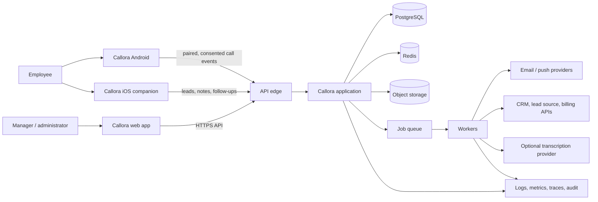

# Callora architecture

- Status: target architecture and implementation guardrails
- Product: Callora team call analytics and lead CRM
- Last updated: 14 July 2026

## 1. Architectural goals

Callora must ingest sensitive mobile call metadata reliably, keep organizations strictly isolated, turn events into explainable metrics, and remain operable by a small engineering team. The recommended starting point is a modular monolith with asynchronous workers and strong domain boundaries. It avoids premature microservice overhead while preserving clear seams for high-volume components to separate later.

Priorities, in order:

1. Tenant isolation, consent, and least-privilege access
2. Correct, idempotent ingestion and explainable metrics
3. Resilience to offline devices, retries, duplicates, and third-party failures
4. Observable background processing and customer-visible freshness
5. Evolvability of reports, integrations, and storage-heavy features
6. Reasonable cost and operational simplicity

## 2. System context



Trust boundaries:

- Mobile devices are untrusted, intermittently connected clients.
- The public web/API edge is hostile input.
- Each organization is a separate authorization boundary inside shared infrastructure.
- Connectors, email, push, payment, and transcription providers are external processors and failure domains.
- Recordings and transcripts are more sensitive than ordinary metadata and require narrower access.

## 3. Recommended technology baseline

The exact provider can change; the component responsibilities should not.

| Layer | Recommended baseline | Reason |
| --- | --- | --- |
| Web | Next.js + React + TypeScript | mature responsive app/router ecosystem, server rendering where useful |
| UI | Tailwind CSS + accessible primitives; Callora-owned components/tokens | consistent original product language and fast iteration |
| API/application | Node.js + TypeScript with NestJS/Fastify or an equivalent structured framework | shared types/tooling and clear module/guard/interceptor conventions |
| Android | Kotlin + Jetpack Compose, Room, WorkManager, Android Keystore | native access to restricted platform APIs and robust offline work |
| iOS | Swift + SwiftUI, URLSession, Keychain | native lifecycle, privacy, push, and CallKit/LiveCommunicationKit research |
| Transactional data | PostgreSQL 16+ | transactions, indexing, JSONB where justified, partitioning, RLS option |
| Cache/coordination | Redis | rate limits, short-lived state, job coordination, cached aggregates |
| Jobs | durable queue backed by Redis initially; managed queue when scale/reliability warrants | retries and asynchronous workloads without blocking APIs |
| Files | S3-compatible private object storage | recordings, imports, exports, lifecycle controls, signed access |
| API contract | REST + OpenAPI; outbound signed webhooks | mobile simplicity, inspectability, connector compatibility |
| Observability | OpenTelemetry, centralized structured logs, metrics/APM, error tracking | cross-service correlation and actionable operations |
| Infrastructure | containerized app/workers, managed PostgreSQL/Redis/object storage, infrastructure as code | smaller operational surface and reproducible environments |

Do not introduce a separate analytics warehouse in the initial MVP. Add one when measured report volume or workload isolation shows PostgreSQL is insufficient.

## 4. Repository shape

Target layout; adapt to the existing workspace without forcing a migration during the first vertical slice.

```text
apps/
  web/                 responsive admin and employee web experience
  api/                 HTTP API and modular application
  worker/              asynchronous jobs and scheduled work
  android/             native Android application
  ios/                 native iOS companion, created in its phase
packages/
  contracts/           OpenAPI-derived clients, schemas, event envelopes
  domain/              pure shared rules where platform-neutral
  ui/                  Callora web design system
  config/              lint, TypeScript, test, and observability defaults
  test-support/        factories, fixtures, fake providers
infra/
  modules/             reusable infrastructure definitions
  environments/        development, staging, production composition
docs/
  decisions/           architecture decision records
  runbooks/            deployment, incident, restore, connector procedures
```

Mobile apps consume generated API clients/contracts; they should not import server implementation packages.

## 5. Backend modules

Keep modules independently testable and prevent direct table access across boundaries except through explicit repositories/services.

| Module | Responsibilities |
| --- | --- |
| Identity | login, MFA/step-up, sessions, refresh/token rotation, account recovery |
| Organizations | tenants, memberships, teams, profile, timezone, retention, feature policy |
| Authorization | roles, permissions, team/data scopes, policy evaluation |
| Employees | work identity, invitation, employment state, number/device associations |
| Devices | pairing, credentials, consent version, permission state, health, sync checkpoints |
| Calls | canonical call events, normalization, deduplication, contacts, notes, pins, matching |
| Metrics | versioned definitions, aggregate queries, snapshots/cache invalidation |
| Leads | lead lifecycle, assignment, statuses, tags, custom fields, timeline, follow-ups |
| Imports/exports | validation, asynchronous jobs, secure files, manifests, failure reports |
| Reports | saved filters, generation, schedules, delivery, secure download |
| Notifications | templates, preferences, email/push/in-app delivery and suppression |
| Recordings | source metadata, upload, object authorization, quotas, retention, playback audit |
| Transcripts | provider abstraction, status, redaction, derivatives, deletion propagation |
| Integrations | API keys, webhooks, adapters, credentials, cursors, retries, replay |
| Billing | plans, entitlements, usage, invoices, payment-event state machine |
| Audit | append-only security/business audit events and controlled query/export |

### Module dependency rule

Identity/organization context and authorization are foundational. Calls and Leads may publish domain events but must not call notification, connector, billing, or transcript providers directly. Those effects are handled asynchronously.

## 6. Request and event model

### Synchronous path

1. Edge applies TLS, request-size limits, coarse rate limits, and bot/abuse controls.
2. API authenticates the principal and resolves exactly one organization context.
3. Authorization evaluates action, organization, team, ownership, and sensitive-data scope.
4. Input is schema-validated and normalized.
5. The module executes a transaction and writes an outbox event when downstream work is required.
6. Response includes a correlation ID; sensitive values are excluded from logs.

### Asynchronous path

Use the transactional outbox pattern: the domain write and event row commit together. A relay publishes pending outbox records to the job/event mechanism. Consumers are idempotent and maintain delivery/attempt state. Failed jobs enter a bounded retry schedule, then a dead-letter state with alerting and replay tooling.

Initial domain events include:

- `device.paired`, `device.permission_changed`, `device.sync_completed`
- `call.accepted`, `call.linked_to_lead`, `call.note_added`
- `lead.created`, `lead.assigned`, `lead.status_changed`, `follow_up.due`
- `import.completed`, `export.completed`, `report.ready`
- `recording.uploaded`, `recording.deleted`, `transcript.completed`
- `subscription.entitlements_changed`

Event envelopes require `event_id`, `event_type`, `schema_version`, `occurred_at`, `organization_id`, `actor`, `correlation_id`, and a payload containing only what the consumer needs.

## 7. Android ingestion design

### Supported behavior

The Android application is a transparent enterprise CRM collector, not a hidden monitor. It reads only the permitted fields required for the declared purpose after corporate authentication, pairing, disclosure, and runtime permission. Google Play review remains a deployment gate.

```mermaid
sequenceDiagram
    participant OS as Android CallLog
    participant App as Callora Android
    participant Local as Encrypted local DB
    participant API as Ingestion API
    participant DB as PostgreSQL
    participant Jobs as Outbox / jobs

    OS-->>App: call-log changed or scheduled reconciliation
    App->>App: normalize and derive device event key
    App->>Local: queue event + advance local checkpoint transactionally
    App->>API: send bounded batch with device credential
    API->>API: authorize device, validate schema, rate-limit
    API->>DB: upsert by tenant/device/event key
    API->>DB: write outbox records in same transaction
    API-->>App: accepted/already-present/rejected item results
    App->>Local: mark acknowledged; retain retryable failures
    DB-->>Jobs: publish accepted call events
    Jobs->>DB: link leads, refresh/invalidate aggregates, notify if needed
```

### Idempotency and identity

Android does not provide a perfect cross-device globally unique ID for every historical call. Callora should derive a stable, versioned fingerprint from organization, device installation, normalized number token, direction/type, start time, and duration, while retaining a local source row/checkpoint when available. The server uses a tenant/device-scoped unique constraint on the event key.

Rules:

- Never use phone number alone as identity.
- Client-generated IDs are untrusted hints; the server enforces scope and uniqueness.
- Event keys are versioned so algorithm changes are explicit.
- Reconciliation may update mutable fields on an existing event but cannot silently change the tenant/device.
- Manual corrections are separate audited records, not destructive rewrites of raw evidence.

### Offline and background behavior

- Room transaction stores an event before acknowledging the local read.
- WorkManager handles network constraints, backoff, app/process restart, and scheduled reconciliation.
- Batches have item and byte limits; partial results are explicit.
- Local data has a bounded retention and is encrypted with keys protected by Android Keystore.
- Health reports last attempted/successful sync, backlog count, permission state, battery restriction, app version, and anonymized diagnostic code.
- Logout, device revocation, or consent withdrawal cancels work, deletes credentials, and stops new reads.

## 8. iOS design boundary

The standard iOS application is a companion for leads, tasks, notes, reports, and user-initiated calls. It must not claim to read normal historical cellular call logs.

- Use `tel:`/system routing for user-initiated calls in the global baseline.
- Use CallKit for Callora-controlled VoIP only if VoIP becomes a product capability.
- Treat default calling/default dialer entitlements as separate feature-flagged capabilities.
- Region- and OS-specific cellular behavior must have runtime eligibility checks and separate store/legal review.
- `CXCallObserver` active-state signals are ephemeral and insufficient to reconstruct a full reliable historical log; do not build analytics assumptions on them.

## 9. Canonical data model

All tenant-owned tables carry a non-null `organization_id`. Primary keys are non-sequential externally safe identifiers. Foreign keys include tenant consistency where possible; repositories always receive tenant context.

Core entities:

```text
Organization
  Membership -> User, Role, Team scope
  Team -> Employee
  Employee -> Device -> DeviceCredential / ConsentReceipt / SyncCheckpoint
  Contact
  CallEvent -> Employee, Device, optional Contact, optional Lead
    CallNote / CallPin / CallCorrection
    Recording -> Transcript
  Lead -> LeadStatus / LeadTag / CustomFieldValue / Assignment / FollowUp
    LeadActivity
  ImportJob / ExportJob / ReportSchedule / ReportRun
  ApiKey / WebhookEndpoint / WebhookDelivery / ConnectorAccount
  Subscription / Entitlement / UsageRecord
  AuditEvent
```

### Raw, canonical, and derived data

- Raw ingest payloads are minimized and retained briefly only when required for troubleshooting.
- `CallEvent` is the canonical normalized record used by product workflows.
- Derived aggregates/snapshots are disposable and reproducible from canonical events.
- Manual corrections are layered over canonical evidence and auditable.
- Report outputs are immutable artifacts tied to a filter definition, metric version, and generation time.

### Essential call fields

- `organization_id`, `device_id`, `employee_id`
- `source`, `source_event_key`, `fingerprint_version`
- normalized direction/type and outcome
- `started_at`, `ended_at` or `duration_seconds`, original device timezone/offset
- encrypted display number and keyed exact-match token; optional redacted suffix
- optional contact/lead links with match source/confidence
- ingestion timestamp, source updated timestamp, and data-quality flags

Avoid storing a contact name or address-book snapshot unless the feature truly requires it and consent/policy covers it.

## 10. Call and metric semantics

Metric definitions are versioned product contracts, not ad hoc chart calculations.

Initial definitions:

- **Total calls:** count of canonical, non-deleted call events in the selected organization/team/employee and time window.
- **Connected:** call event with positive connected duration according to the normalized source outcome.
- **Talk time:** sum of connected duration; ringing time is excluded.
- **Missed:** inbound call not connected and normalized as missed.
- **Rejected:** inbound call explicitly declined where the source can distinguish it.
- **Unique clients:** distinct normalized external-number tokens, excluding organization-configured internal/excluded numbers.
- **Never attended:** external number with one or more inbound missed events and no later connected call within the defined lookback/window policy.
- **Client not pickup:** outbound attempt not connected; exact labels depend on what the source can prove.
- **Working span:** elapsed time from first to last qualifying work call, not employee work hours, unless product wording clearly distinguishes it.

Rules:

- Organization timezone controls date buckets; UTC is stored.
- Every report exposes timezone, filter, generation time, and metric-definition version.
- Unknown source states remain `unknown`; do not infer a precise outcome without evidence.
- Aggregates must reconcile with the filtered canonical list.
- Metric changes require an architecture/product decision, migration/backfill assessment, and regression fixtures.

## 11. Multi-tenancy and authorization

### Enforcement layers

1. Session/device/API-key credential resolves a principal.
2. Tenant context is selected from a verified membership or device binding, never trusted from a free-form header alone.
3. Policy engine evaluates role, action, team, ownership, and sensitive-data grant.
4. Repository methods require `organization_id`; unscoped data methods are banned outside migrations/administration.
5. Database constraints and optional PostgreSQL RLS provide defense in depth.
6. Object keys are tenant-scoped, private, and accessed through short-lived authorized URLs.
7. Audit captures sensitive reads/exports/playback and all administrative mutations.

### Sensitive permission examples

- `calls.read_metadata`
- `calls.export`
- `recordings.read`
- `recordings.download`
- `transcripts.read`
- `leads.assign`
- `reports.schedule`
- `devices.revoke`
- `audit.read`
- `organization.retention_manage`

Recording access is never implied by ordinary call-metadata access.

## 12. Security and privacy architecture

### Data protection

- TLS 1.2+ externally and encrypted managed-service connections internally
- Provider-managed encryption at rest, plus application/field-level protection for selected phone/audio/transcript metadata where threat modeling warrants it
- Envelope encryption with a managed KMS; keys and service secrets never stored in source or database rows in plaintext
- Keyed deterministic token/HMAC for exact phone lookup; encrypted value for authorized display
- Private object buckets, blocked public ACLs, short-lived signed URLs, content disposition controls, and access logging
- Separate production/staging keys, buckets, databases, provider projects, and connector credentials

### Authentication and sessions

- OIDC-compatible identity or audited managed authentication
- Short-lived access tokens/sessions and rotating refresh tokens
- Device credential bound to organization, employee, installation, and scopes
- MFA/step-up for owners, billing, exports, connector secrets, recording access policy, and destructive administration
- Revocation on employee offboarding, password/security event, organization suspension, or consent withdrawal

### Application controls

- Strict schema validation and output encoding
- CSRF protection for cookie sessions; secure, HTTP-only, same-site cookies
- Rate limits by IP, user, organization, device, endpoint, and cost class
- File type/signature/size validation; malware scanning or quarantine before processing
- SSRF-safe connector fetches with egress controls and destination allow/deny policy
- Webhook HMAC signature, timestamp window, secret rotation, and replay protection
- Dependency/secret/container scanning and signed/traceable builds
- No sensitive call, lead, audio, transcript, token, or connector payload in logs/traces

### Retention and deletion

Retention is policy-driven per data class with organization configuration inside legal/product bounds. A deletion workflow creates an auditable job, tombstones inaccessible records where necessary, removes objects and derivatives, expires caches/exports, instructs processors, and records completion/failures. Backups expire on their normal protected lifecycle; restore procedures reapply deletion tombstones before restored data becomes accessible.

## 13. Recording and transcription architecture

Recording support is optional and isolated.

1. A lawful source supplies a recording file: supported OEM directory, user-selected file, or telephony/VoIP provider.
2. Mobile/provider requests an upload session for a known call and sends metadata/checksum.
3. API authorizes organization, device/actor, feature entitlement, consent policy, MIME/size, and quota.
4. Client uploads directly to a quarantined private object key using a short-lived URL.
5. Worker validates checksum/signature/type, scans where applicable, and promotes to the protected bucket/key.
6. Playback issues a short-lived, audience-bound authorization after a fresh permission check and emits an audit event.
7. Optional transcript job uses a provider abstraction, minimum necessary payload, configured region/retention, and a deletion callback/job.

Recordings, transcripts, snippets, and waveform derivatives share one lifecycle manifest so deletion cannot leave orphans.

## 14. Reporting and analytical load

Start with PostgreSQL and disciplined query design:

- Composite indexes begin with `organization_id` and common time/filter dimensions.
- Use keyset/cursor pagination for call and activity lists.
- Cache only permission-safe aggregate results, keyed by tenant, scope, filter, timezone, and metric version.
- Invalidate or use short TTLs based on accepted call/lead events.
- Run exports/reports as jobs with snapshot metadata and bounded date/row limits.
- Use read replicas for large report reads when measured contention appears.
- Move append-only events/aggregates to a columnar warehouse only when volume, latency, or cost evidence justifies it.

Partitioning by time may help large call tables, but tenant-aware indexes and maintenance behavior must be proven first. Avoid per-tenant schemas/databases until contractual isolation or scale requires them.

## 15. External APIs and integrations

### Public REST API

- Version in the path or media type and publish OpenAPI.
- Use cursor pagination and consistent error envelopes.
- Support idempotency keys on create/import/action endpoints.
- Scope API keys by organization and permissions; show secret once and store a hash.
- Publish rate-limit headers and change/deprecation policy.
- Never expose internal database identifiers when a safer public ID exists.

### Outbound webhooks

- Sign the raw request body with HMAC and include event ID, timestamp, and schema version.
- At-least-once delivery means customers must deduplicate by event ID.
- Exponential backoff, maximum age/attempts, pause on persistent failure, and manual replay.
- Delivery UI shows endpoint, status, attempt time, response class, and redacted error—not sensitive payload by default.

### Connector adapters

Each connector owns credential schema, remote ID mapping, cursor/checkpoint, rate-limit handling, error classification, replay, and health. Connector jobs are tenant-isolated; a bad credential or provider outage cannot block call ingestion or unrelated organizations.

## 16. Deployment topology

### Environments

- Local: containerized dependencies, fake providers, deterministic seeded tenant
- Preview: ephemeral web/API where practical, synthetic data only
- Staging: production-like isolation, store/internal mobile test tracks, provider sandboxes
- Production: separate cloud account/project, credentials, network, data stores, buckets, and alert routing

### Production components

- CDN/WAF/load balancer in front of the web/API services
- Stateless web and API containers across at least two failure zones where available
- Independently scalable worker pools: default jobs, exports/reports, connector deliveries, media/transcription
- Managed PostgreSQL with point-in-time recovery and tested replicas/backups
- Managed Redis with persistence/HA appropriate to whether it contains durable queue state
- Private object storage with versioning/lifecycle rules and separate quarantine/protected/export prefixes or buckets
- KMS/secrets manager, container registry, DNS/certificates, centralized telemetry

### Delivery strategy

1. Build an immutable artifact once; promote the same digest.
2. Run backwards-compatible database expansion before application rollout.
3. Deploy canary or rolling instances and verify health/error/latency/business signals.
4. Enable risky behavior behind organization-aware feature flags.
5. Contract/migration checks prevent incompatible mobile/server releases.
6. Remove old columns/behavior only after mobile minimum-version and rollback windows close.

Database migrations should use expand/migrate/contract. A rollback may be application rollback or forward fix; destructive down migrations are not assumed safe.

## 17. Observability and SLOs

### Telemetry

- Structured JSON logs with timestamp, severity, service, version, environment, correlation ID, organization surrogate, actor/device surrogate, route/job type, and outcome
- Distributed traces across edge, API, database, outbox, job, provider, and webhook delivery
- RED metrics for APIs: rate, errors, duration
- USE metrics for infrastructure: utilization, saturation, errors
- Business/data-path metrics: accepted/rejected/duplicate calls, ingest lag, device backlog, stale devices, outbox lag, job retries/DLQ, report duration, webhook success, connector lag, recording bytes, transcript cost
- Audit events are a controlled product/security data store, not application logs

### Initial alerts

- Availability/error-budget burn, elevated 5xx, and latency regression
- Database saturation, connection exhaustion, replication lag, and backup failure
- Outbox/queue age or DLQ growth
- Call ingest acceptance drops or lag spikes by app version/OEM
- Authentication/permission anomaly and tenant-isolation security signal
- Webhook/connector provider-wide failure
- Object upload scan backlog, storage growth, and transcript budget threshold
- Scheduled report miss and notification provider failure

### Customer-visible health

Expose last successful device sync, permission/consent status, app version support, connector state, and last scheduled report result. Do not describe stale data as real-time.

## 18. Resilience and failure handling

- Every mutating mobile/public endpoint supports safe retry through event identity or idempotency key.
- Provider calls have explicit timeouts, bounded retries with jitter, circuit breaking, and failure classification.
- Background jobs are at-least-once; side effects use dedupe keys/state machines.
- Bulkheads isolate media, exports, connectors, and notifications from transactional API capacity.
- Backpressure rejects/defer non-critical jobs before database/API collapse.
- Degraded modes preserve call/lead writes when analytics, notifications, connectors, or transcription fail.
- Device and connector checkpoints advance only after durable local/server acceptance.
- Dead-letter replay tooling requires authorization, reason, and audit.

## 19. Testing architecture

### Core invariants

- No query, object, cache, export, job, or webhook crosses organization scope.
- Retrying the same call/import/payment/provider event does not duplicate product state.
- Dashboard results reconcile to canonical records for identical scope/timezone/filter/version.
- Revocation and consent withdrawal stop access/collection promptly.
- Deletion reaches canonical records, search tokens, objects, derivatives, cached/exported artifacts, and processors.

### Test portfolio

| Layer | Focus |
| --- | --- |
| Unit/property | metrics, normalization, fingerprint stability, state machines, policies, retention |
| Database integration | tenant constraints/RLS, transactions, outbox, concurrency, migrations, query plans |
| Contract | generated mobile clients, ingest versions, webhook signatures, provider adapters |
| Web E2E | auth, roles, dashboard, calls, leads, imports/exports, settings, deletion |
| Android | permissions, process death, clock skew, offline backlog, WorkManager, upgrades, supported OEMs |
| iOS | authentication, offline edits, `tel:` flow, notifications, permission-safe UI |
| Performance | ingest bursts, dashboard fan-out, large tenant filters, exports, media URLs |
| Security | IDOR/tenant escape, privilege escalation, injection, CSRF, SSRF, file abuse, secret leakage |
| Recovery | point-in-time restore, object/version recovery, queue replay, deletion tombstone reapplication |

Use production-like synthetic data; never copy customer call logs or recordings into non-production environments.

## 20. Capacity model

Before pilot, record explicit assumptions:

- organizations, employees per organization, devices per employee;
- calls per device/day and peak post-call ingest burst;
- lead count, import size, report/export period and concurrency;
- recording attach rate, average duration/bitrate, retention, transcript percentage;
- connector/webhook endpoints and delivery rate;
- read/write ratio and dashboard refresh behavior.

Run load tests at expected peak and at least 2× peak. Cost models must include database I/O, object storage/egress, email/push, transcription, observability, and backups—not only compute.

## 21. Evolution triggers

Split a component from the modular monolith only when a measured need appears:

- ingestion service: sustained burst or independent availability/scaling requirement;
- report/analytics service or warehouse: analytical queries harm transactional SLOs;
- media service: storage, upload, scan, and playback scale/security needs independent isolation;
- connector service: provider failures or deployment cadence threaten core stability;
- authorization service: multiple products need one policy plane and latency is controlled.

A split requires an owner, service SLO, data ownership, migration plan, operational budget, and failure semantics. A queue alone does not make a boundary well designed.

## 22. Architecture decisions still open

Record each as an ADR before implementation commits to it:

1. Authentication provider and MFA/enterprise identity approach
2. Application-only tenant enforcement versus application plus PostgreSQL RLS
3. Durable job technology and its failure/backup guarantees
4. Cloud/region and data-residency commitments
5. Phone-number encryption/search/tokenization design
6. Android public Play, managed Play, private distribution, or combined route
7. Recording source and supported-device/provider matrix
8. First connector, billing provider, tax/currency scope
9. Observability vendor and sensitive-data scrubbing controls
10. Minimum supported mobile versions and forced/soft upgrade policy

## 23. Architecture review checklist

Before merging a new feature, confirm:

- Which tenant and role scopes apply?
- Does it collect, expose, export, or send new personal/sensitive data?
- Is disclosure/consent/store data-safety text affected?
- Is the write idempotent, transactional, and audited?
- Can retries, concurrency, clock skew, or offline clients corrupt state?
- What happens when its provider, queue, cache, or database is slow/unavailable?
- Are logs/traces free from numbers, names, notes, audio, transcripts, tokens, and secrets?
- How is data retained, exported, corrected, and deleted?
- What metric, alert, runbook, capacity, and cost guardrail make it operable?
- Can it be rolled back or disabled per organization without losing accepted data?
